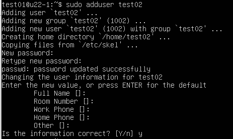

# [Ubuntu 22.04] 使用指令新增使用者

新增使用者有 `useradd` 和 `adduser` 兩種指令，
使用 `useradd` 時**每一項**都需要管理者自行下指令更改命令與參數，
而 `adduser` 則是將 `useradd` 的各參數與功能包裝為詢問方式來新增使用者，
使用起來較為簡單。

## 使用 adduser 新增使用者

``` shell
# 新增使用者
sudo adduser your_user_name
```

然後會跳出一些基本設定，密碼、名稱、電話等：



執行指令後，Ubuntu 會自動幫使用者新增 Home 資料夾並設定該資料夾的初始設定。

## 將使用者加入群組

若要將該使用者加入某個群組，例如加入 `sudo` ，使該使用者可以執行 sudo 指令：

``` shell
sudo adduser your_user_name sudo
```

## 更改使用者的Home目錄

若要修改使用者的目錄，可以使用以下指令：
```shell
sudo usermod -d /your_home_directory your_user_name
```

## 切換當前使用者

使用以下指令切換當前使用者：
``` shell
su your_user_name
```