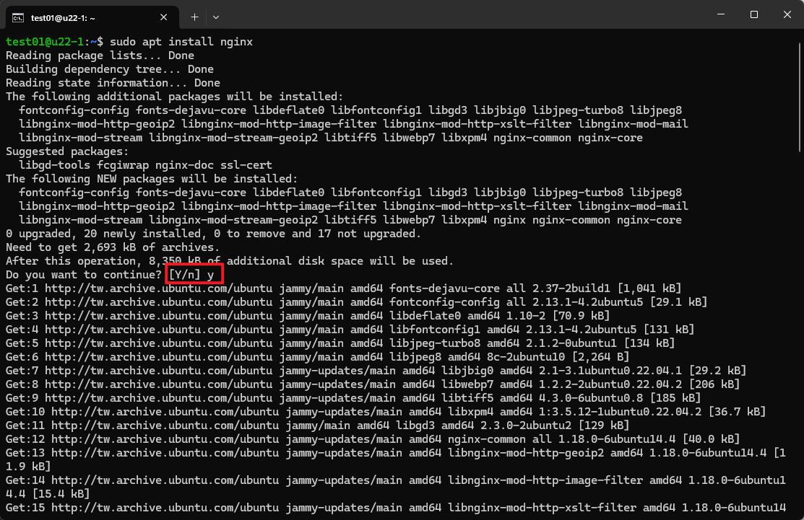
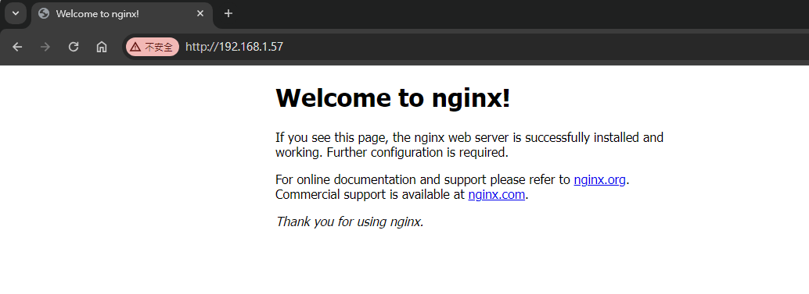
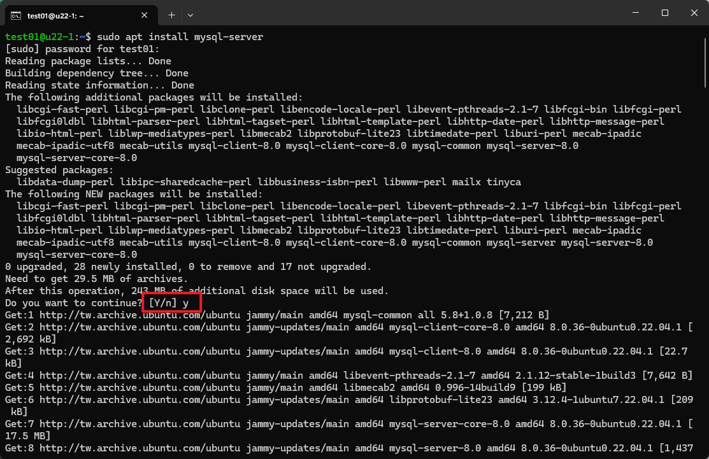
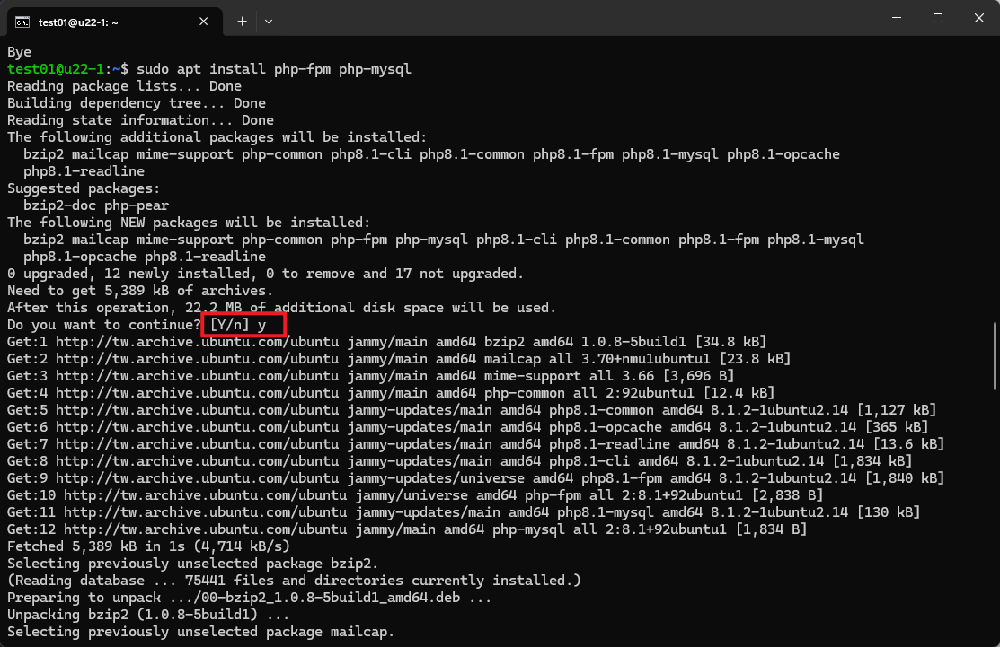
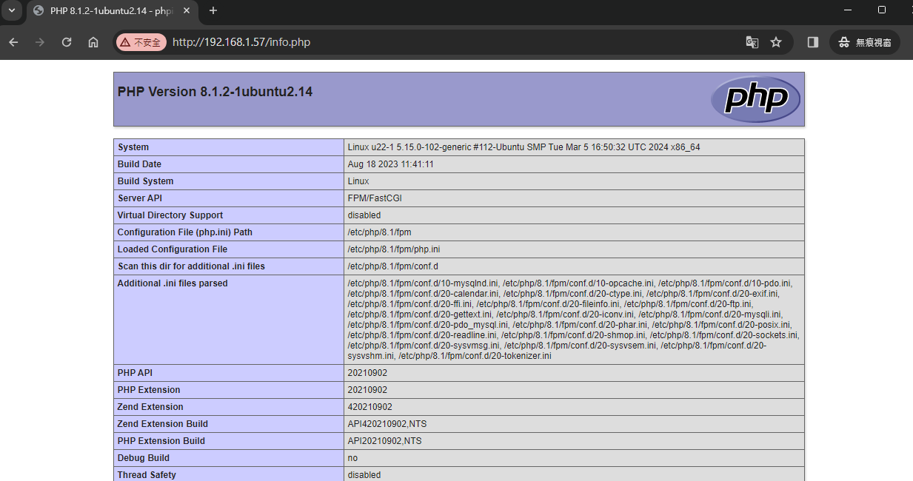

# [Ubuntu 22.04] 安裝 Nginx、Mysql、PHP (LEMP)

LEMP 軟體堆疊是一組軟體，可以用來提供使用 `PHP` 編寫的動態網頁和網頁應用程式。包含 `Linux` 作業系統的系統，搭配 `Nginx` 網頁伺服器。而後端則由 `PHP` 處理，資料庫為 `Mysql`。

## 1. 安裝 Nginx 網頁伺服器
### 1-1. 安裝 Nginx

首先先更新一下 apt 套件清單，以便取得最新的套件資訊：

```bash
sudo apt update
```

然後安裝 nginx：
```bash
sudo apt install nginx
```

當系統詢問你是否繼續時，請回答「y」，



### 1-2 測試 Nginx
檢查Nginx是否正在運行：
```bash
systemctl status nginx
```
若得到以下結果(active)，表示 Nginx 正在運行
```bash
● nginx.service - A high performance web server and a reverse proxy server
     Loaded: loaded (/lib/systemd/system/nginx.service; enabled; vendor preset: enabled)
     Active: active (running) since Wed 2024-04-10 15:09:45 UTC; 32min ago
       Docs: man:nginx(8)
    Process: 1902 ExecStartPre=/usr/sbin/nginx -t -q -g daemon on; master_process on; (code=exited, status=0/SUCCESS)
    Process: 1903 ExecStart=/usr/sbin/nginx -g daemon on; master_process on; (code=exited, status=0/SUCCESS)
   Main PID: 1999 (nginx)
      Tasks: 3 (limit: 4558)
     Memory: 5.4M
        CPU: 36ms
     CGroup: /system.slice/nginx.service
             ├─1999 "nginx: master process /usr/sbin/nginx -g daemon on; master_process on;"
             ├─2001 "nginx: worker process" "" "" "" "" "" "" "" "" "" "" "" "" "" "" "" "" "" "" "" "" "" "" "" "" "" >
             └─2002 "nginx: worker process" "" "" "" "" "" "" "" "" "" "" "" "" "" "" "" "" "" "" "" "" "" "" "" "" "" >
```

接下來，我們可以在瀏覽器的地址欄輸入：
```plaintext
http://your_IP
```
便可以看到 Nginx 的預設頁面：




如果看到這個頁面就表示伺服器已正常運行。

## 2. 安裝 Mysql

```bash
sudo apt install mysql-server
```

當系統詢問你是否繼續時，請回答「y」，




當安裝完成後，執行以下命令來進行安全設置：

```bash
sudo mysql_secure_installation
```

接下來你會被詢問是否想要配置 VALIDATE PASSWORD PLUGIN。
回答 Y 表示是，或者輸入其他內容繼續而不啟用：

```bash
Securing the MySQL server deployment.

Connecting to MySQL using a blank password.

VALIDATE PASSWORD COMPONENT can be used to test passwords
and improve security. It checks the strength of password
and allows the users to set only those passwords which are
secure enough. Would you like to setup VALIDATE PASSWORD component?

Press y|Y for Yes, any other key for No: y
```

如果回答是，將會被要求選擇一個密碼等級：

```bash
There are three levels of password validation policy:

LOW    Length >= 8
MEDIUM Length >= 8, numeric, mixed case, and special characters
STRONG Length >= 8, numeric, mixed case, special characters and dictionary                  file

Please enter 0 = LOW, 1 = MEDIUM and 2 = STRONG: 2
```


Ubuntu 上 Mysql 管理使用者的預設認證方法是 auth_socket ，而不是使用密碼的方式，如果要修改認證方法，請使用 ALTER_USER 指令，相關內容請查看：[https://dev.mysql.com/doc/refman/8.0/en/alter-user.html#alter-user-password-management](https://dev.mysql.com/doc/refman/8.0/en/alter-user.html#alter-user-password-management)

```bash
Skipping password set for root as authentication with auth_socket is used by default.
If you would like to use password authentication instead, this can be done with the "ALTER_USER" command.
See https://dev.mysql.com/doc/refman/8.0/en/alter-user.html#alter-user-password-management for more information.
```

接下來會收到一系列詢問：

1. 刪除匿名用戶：

```bash
By default, a MySQL installation has an anonymous user,
allowing anyone to log into MySQL without having to have
a user account created for them. This is intended only for
testing, and to make the installation go a bit smoother.
You should remove them before moving into a production
environment.

Remove anonymous users? (Press y|Y for Yes, any other key for No) : y
Success.
```

2. 禁止遠程登入：
```bash
Normally, root should only be allowed to connect from
'localhost'. This ensures that someone cannot guess at
the root password from the network.

Disallow root login remotely? (Press y|Y for Yes, any other key for No) : y
Success.
```

3. 移除測試資料表：
```bash
By default, MySQL comes with a database named 'test' that
anyone can access. This is also intended only for testing,
and should be removed before moving into a production
environment.


Remove test database and access to it? (Press y|Y for Yes, any other key for No) : y
 - Dropping test database...
Success.

 - Removing privileges on test database...
Success.
```

4. 重新加載權限表：
```bash
Reloading the privilege tables will ensure that all changes
made so far will take effect immediately.

Reload privilege tables now? (Press y|Y for Yes, any other key for No) : y
Success.
```

5. 完成：
```bash
All done!
```

完成後，測試是否能夠登入 MySQL 控制台：
```bash
sudo mysql
```

這樣會以管理資料庫使用者 root 身分 連接到 mysql 伺服器，成功後你應該會收到以下輸出：
```bash
Welcome to the MySQL monitor.  Commands end with ; or \g.
Your MySQL connection id is 16
Server version: 8.0.36-0ubuntu0.22.04.1 (Ubuntu)

Copyright (c) 2000, 2024, Oracle and/or its affiliates.

Oracle is a registered trademark of Oracle Corporation and/or its
affiliates. Other names may be trademarks of their respective
owners.

Type 'help;' or '\h' for help. Type '\c' to clear the current input statement.

mysql>
```

退出 MySQL 控制台：
```bash
mysql> exit
```

## 3. 安裝 PHP

執行以下指令安裝 PHP：
```bash
sudo apt install php-fpm php-mysql
```

當系統詢問你是否繼續時，請回答「y」，




### 測試 php

接下來我們要修改 Nginx 配置，使其解析到PHP檔時，將會使用php-fpm進行解析

先取得取得 php-fpm 版本備用：
```bash
apt-cache show php-fpm
```

得到以下結果，此處版本即為 8.1：
```bash
Package: php-fpm
Architecture: all
Version: 2:8.1+92ubuntu1
Priority: optional
Section: universe/php
Source: php-defaults (92ubuntu1)
Origin: Ubuntu
Maintainer: Ubuntu Developers <ubuntu-devel-discuss@lists.ubuntu.com>
Original-Maintainer: Debian PHP Maintainers <team+pkg-php@tracker.debian.org>
Bugs: https://bugs.launchpad.net/ubuntu/+filebug
Installed-Size: 14
Depends: php8.1-fpm
Filename: pool/universe/p/php-defaults/php-fpm_8.1+92ubuntu1_all.deb
Size: 2838
MD5sum: 6ab16350b4bce78381cb3d0d54192c62
SHA1: 2f7d48cba1fada14c0a9c54e2af06de7e4c8496d
SHA256: 9ceb16e44c56a8aeab8267e314f2b9f2e7223d8f63eee7219c596d623f63fadf
SHA512: 57577dbc0e19a33218e36489de0fab1fccc6e885d9b2bf419a2ea64199aa2caef0f58418e75af3d1a295c1f376875eff475448e03c6eec8d1fd8538cdb84acfe
Description-en: server-side, HTML-embedded scripting language (FPM-CGI binary) (default)
 This package provides the Fast Process Manager interpreter that runs
 as a daemon and receives Fast/CGI requests.
 .
 PHP (recursive acronym for PHP: Hypertext Preprocessor) is a widely-used
 open source general-purpose scripting language that is especially suited
 for web development and can be embedded into HTML.
 .
 This package is a dependency package, which depends on latest stable
 PHP version (currently 8.1).
Description-md5: 2f8aa0d9c24f7f33d4218178375a12d2
```

接著執行以下指令，進入到修改頁面：

```bash
sudo nano /etc/nginx/sites-available/default
```

你會看到以下內容(不含註釋)：
```bash
server {
        listen 80 default_server;
        listen [::]:80 default_server;

        root /var/www/html;

        index index.html index.htm index.nginx-debian.html;

        server_name _;

        location / {
                try_files $uri $uri/ =404;
        }
}
```

修改為以下內容（紅色部分為修改內容）：

_**請注意**：fastcgi_pass unix:/run/php/php<font color="red">8.1</font>-fpm.sock，此處的php-fpm版本請填入上面查到的php-fpm版本，_


<pre>
<code class="hljs">server {
        listen 80 default_server;
        listen [::]:80 default_server;

        root /var/www/html;

        index index.html index.htm <span style="color:red">index.php</span> index.nginx-debian.html;

        server_name _;

        location / {
                try_files $uri $uri/ =404;
        }

        <span style="color:red">location ~ \.php$ {</span>
        <span style="color:red">        include snippets/fastcgi-php.conf;</span>
        <span style="color:red">        fastcgi_pass unix:/run/php/php8.1-fpm.sock;</span>
        <span style="color:red">}</span>

        <span style="color:red">location ~ /\.ht {</span>
        <span style="color:red">    deny all;</span>
        <span style="color:red">}</span>
}
</code>
</pre>

修改完後，按下「Ctrl + X」，接著按下「Y」退出。
接著使用 `sudo nginx -t` 檢查設定檔格式有沒有錯誤，如果顯示以下文字表示設定檔格式沒有錯誤：
```bash
nginx: the configuration file /etc/nginx/nginx.conf syntax is ok
nginx: configuration file /etc/nginx/nginx.conf test is successful
```

重新載入 nginx 設定：
```bash
sudo systemctl reload nginx
```

接著輸入以下指令，產生info.php檔案：
```bash
echo '<?php phpinfo();' | sudo tee /var/www/html/info.php
```

接著在瀏覽器中查看以下網址：
```plaintext
http://your_IP/info.php
```

如果出現以下畫面則表示配置成功：



這樣便完成了 Nginx、Mysql、PHP的安裝了。