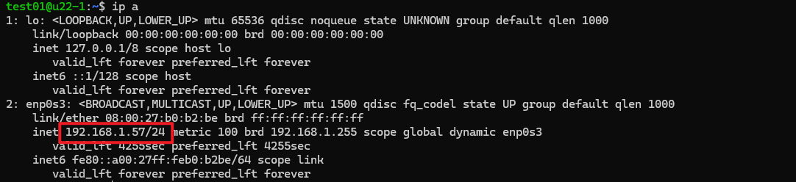
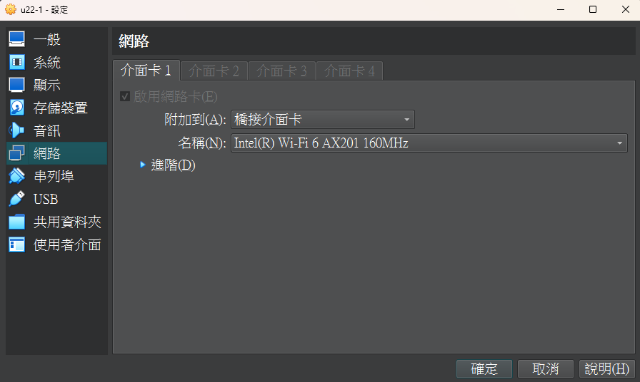
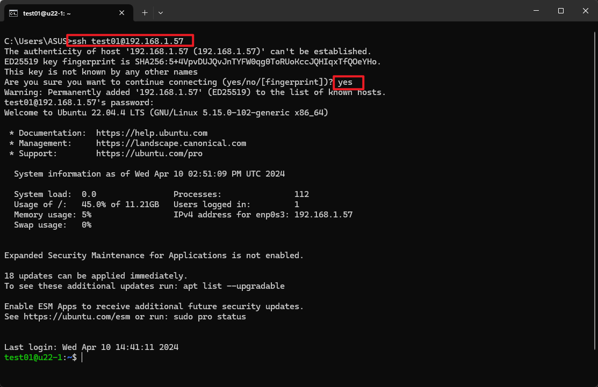

# [Ubuntu 22.04] 安裝 ssh 服務

## 查看系統有無安裝 ssh server 服務

執行以下指令：
```bash
systemctl status ssh
```
如果出現以下結果表示沒有安裝：
```bash
Unit ssh.service could not be found.
```

## 安裝 ssh

```bash
sudo apt update && sudo apt install ssh -y
```

安裝完後執行 `systemctl status ssh` 檢查 ssh 服務狀態：
```bash
● ssh.service - OpenBSD Secure Shell server
     Loaded: loaded (/lib/systemd/system/ssh.service; enabled; vendor preset: enabled)
     Active: active (running) since Wed 2024-04-10 14:40:55 UTC; 35min ago
       Docs: man:sshd(8)
             man:sshd_config(5)
   Main PID: 709 (sshd)
      Tasks: 1 (limit: 4558)
     Memory: 6.7M
        CPU: 87ms
     CGroup: /system.slice/ssh.service
             └─709 "sshd: /usr/sbin/sshd -D [listener] 0 of 10-100 startups"

Warning: some journal files were not opened due to insufficient permissions.
```


看到顯示active 表示成功啟用該服務。

## 查看 ip 位址
```bash
ip a

# 或是
ifconfig # 需要安裝net-tools
```

將會得到以下結果，ip 即為 192.168.1.57。



<font color="red">_※ 如果你使用的是 Oracle VM VirtualBox，記得將虛擬機的**網路介面卡**設為**橋接介面卡**，否則無法連線，如：_</font>



## 使用 cmd 連線

想要連線至 Ubuntu，你可以使用 ssh client 軟體，如 cmd 、 putty 等，
這邊先使用大家都有的 cmd 連線。

先確認是否能與 ubuntu 的 ip 進行通訊：
``` batch
ping your_ubuntu_IP
# ping 192.168.1.57
```
確認可以連線後：
```batch
ssh your_ubuntu_username@your_ubuntu_IP
# ssh test01@192.168.1.57
```

第一次連線的時候會詢問一些事項，輸入 yes，
然後輸入密碼，就成功連進 Ubuntu 了。




