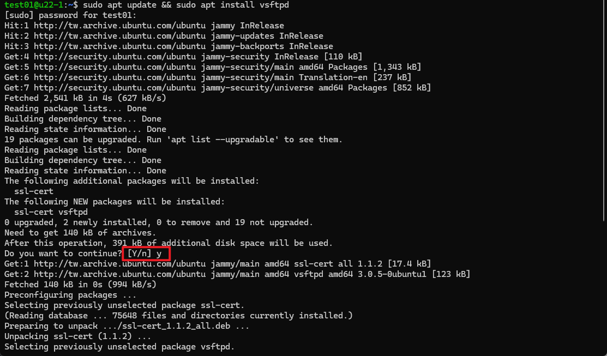

# [Ubuntu 22.04] 安裝 ftp server

## 安裝 vsftp

透過以下指令，更新 apt 套件清單以及安裝 vsftp
```bash 
sudo apt update && sudo apt install vsftpd
```

當系統詢問你是否繼續時，請回答「y」：



安裝完成後可輸入 `systemctl status vsftpd` 查看是否正常安裝及運作：

```bash
● vsftpd.service - vsftpd FTP server
     Loaded: loaded (/lib/systemd/system/vsftpd.service; enabled; vendor preset: enabled)
     Active: active (running) since Wed 2024-04-10 18:04:09 UTC; 3min 3s ago
    Process: 11446 ExecStartPre=/bin/mkdir -p /var/run/vsftpd/empty (code=exited, status=0/SUCCESS)
   Main PID: 11447 (vsftpd)
      Tasks: 1 (limit: 4558)
     Memory: 860.0K
        CPU: 7ms
     CGroup: /system.slice/vsftpd.service
             └─11447 /usr/sbin/vsftpd /etc/vsftpd.conf
```

## 設定 vsftp

vsftp 的設定檔在 `/etc/vsftpd.conf`，以下簡單介紹幾個設定值

```bash
sudo nano /etc/vsftpd.conf
```

### 1. 存取限制
設定禁止匿名者登入，及本地帳號皆可使用
```bash
anonymous_enable=NO
local_enable=YES
```
### 2. 允許上傳
若要讓使用者上傳檔案需打開此設定
```bash
write_enable=YES
```

### 3. 限制目錄切換
將使用者限制在特定區域，加上以下兩條設定
```bash
chroot_local_user=YES # 限制本地所有使用者
allow_writeable_chroot=YES
chroot_list_enable=YES # 當此設定被啟用時，被列入名單內的使用者會被限制目錄切換
chroot_list_file=/etc/vsftpd.chroot_list 
```

### 4. 限制登入
除了上面設定的本機使用者可以登入外，也可以使用下面這些設定，僅讓清單上的使用者登入ftp(或讓清單上的使用者不能登入ftp)，我們將設定檔放在 `/etc/vsftpd.user_list` 內，檔案內一行為一個使用者帳號

```bash
userlist_enable=YES # 以下兩個設定，必須要此設定啟用時才會生效
userlist_deny=NO # 當此設定為YES時，若某使用者帳號被列入名單內，則該使用者不能登入ftp，反之為NO時，只有名單內使用者才能登入ftp
userlist_file=/etc/vsftpd.user_list
```

## 建立及設定 ftp 使用者

使用 `adduser` 建立使用者

```bash
sudo adduser 使用者名稱
```

將該使用者加入到允許登入清單中
```bash
echo "使用者名稱" | sudo tee -a /etc/vsftpd.user_list
```