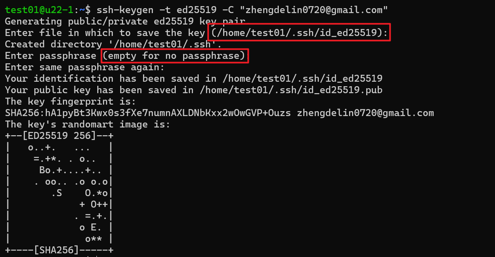
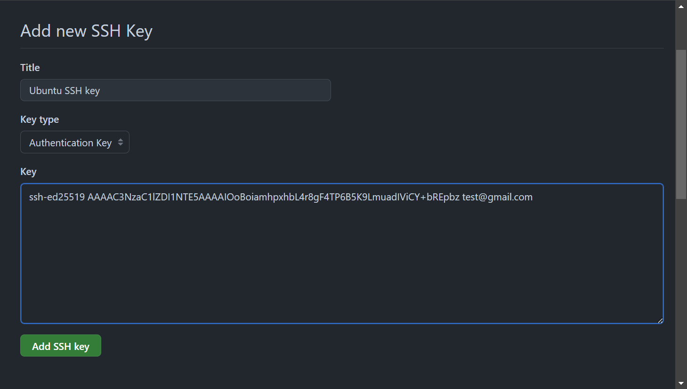

# [Ubuntu 22.04] 安裝 Git

## 安裝 git

更新 apt 套件列表以及安裝 git：

```bash
sudo apt update && sudo apt install git
```

使用 `git --version` 指令檢查已安裝的 git 版本：
```bash
git version 2.34.1
```

## 配置 git

使用以下指令來配置 git 使用者的 name 和 email：

```bash
git config --global user.name "your_user_name"
git config --global user.email "your_user_email"
```

使用 `git config --list` 來驗證配置：
```bash
user.name=test
user.email=test@gmail.com
```

## 使用 SSH 來 Clone Repository

要使用 SSH 的方式來 Clone 專案，必須要在 Ubuntu 上生成 SSH key 後，上 [github](https://github.com) 網站上設置 SSH key

### 1. 生成 SSH key
使用以下指令生成 SSH key：
```bash
ssh-keygen -t ed25519 -C "user@example.com"
```
* `-t` 表示指定要生成的 key 的類型，此處為 ed25519
* `-C` 表示該 key 的附加訊息

接下來會詢問儲存位置、密碼，如果沒有更改需要的話直接按 Enter 就行，如果設置密碼的話，之後每次 Clone 的時候都會需要輸入密碼



可以使用 `ls ~/.ssh` 查看生成的檔案：
```bash
id_ed25519  id_ed25519.pub
```

使用 `cat ~/.ssh/id_ed25519.pub` 查看 public key：
```bash
ssh-ed25519 AAAAC3NzaC1lZDI1NTE5AAAAIOoBoiamhpxhbL4r8gF4TP6B5K9LmuadIViCY+bREpbz test@gmail.com
```

### 2. 將 Public Key 新增至 Github Account

執行 `cat ~/.ssh/id_ed25519.pub` 並複製至剪貼簿。
```bash
ssh-ed25519 AAAAC3NzaC1lZDI1NTE5AAAAIOoBoiamhpxhbL4r8gF4TP6B5K9LmuadIViCY+bREpbz test@gmail.com
```

接下來前往 [Github](https://github.com)

1. 登入 Github
2. 前往 "Settings"
3. 左側 Menu 處點擊 "SSH and GPG keys"
4. 點擊 "New SSH key" 按鈕

或者直接由此連結前往 [https://github.com/settings/ssh/new](https://github.com/settings/ssh/new)

在此處你需要：
1. 填入SSH key 標題
2. 貼上 SSH key
3. 按下 "Add SSH key" 按鈕




> 參考文檔： <a href="https://docs.github.com/en/authentication/connecting-to-github-with-ssh/generating-a-new-ssh-key-and-adding-it-to-the-ssh-agent?platform=linux" target="_blank">在 Linux 中新增 SSH key</a>
參考文檔： <a href="https://docs.github.com/en/authentication/connecting-to-github-with-ssh/adding-a-new-ssh-key-to-your-github-account" target="_blank">在 Github 中新增 SSH Key</a>


### 3. Clone Repository


在 Ubuntu 中使用 `git clone` 來 clone repository

### 4. 指定 ssh-agent 的 SSH Key
如果你不想每次 Clone 的時候都輸入密碼，可以將金鑰新增至 SSH 代理程式管理的金鑰清單，首先先使用以下命令確保 SSH 代理正在執行：
```bash
eval "$(ssh-agent -s)"
```
執行結果：
```bash
Agent pid 2284
```

然後使用以下命令添加私鑰文件：
```bash
ssh-add ~/.ssh/id_ed25519
```
執行結果：
```bash
Identity added: /home/test01/.ssh/id_ed25519 (test01@gmail.com)
```
