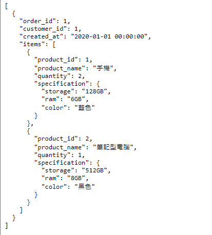

# json格式的練習以採購訂單為例，php整批讀寫檔案跟逐行讀寫

成果：

原始 Json 檔 orders.json
```json
[
  {
    "order_id": 1,
    "customer_id": 1,
    "created_at": "2020-01-01 00:00:00",
    "items": [
      {
        "product_id": 1,
        "product_name": "手機",
        "quantity": 2,
        "specification": {
          "storage": "128GB",
          "ram": "6GB",
          "color": "藍色"
        }
      },
      {
        "product_id": 2,
        "product_name": "筆記型電腦",
        "quantity": 1,
        "specification": {
          "storage": "512GB",
          "ram": "8GB",
          "color": "黑色"
        }
      }
    ]
  }
]
```

一次讀取全部 Json 檔內容並寫入 orders_all.json

```json
[
  {
    "order_id": 1,
    "customer_id": 1,
    "created_at": "2020-01-01 00:00:00",
    "items": [
      {
        "product_id": 1,
        "product_name": "手機",
        "quantity": 2,
        "specification": {
          "storage": "128GB",
          "ram": "6GB",
          "color": "藍色"
        }
      },
      {
        "product_id": 2,
        "product_name": "筆記型電腦",
        "quantity": 1,
        "specification": {
          "storage": "512GB",
          "ram": "8GB",
          "color": "黑色"
        }
      }
    ]
  }
]
```

逐行讀取 Json 並寫入 orders_lines.json
```json
[
  {
    "order_id": 1,
    "customer_id": 1,
    "created_at": "2020-01-01 00:00:00",
    "items": [
      {
        "product_id": 1,
        "product_name": "手機",
        "quantity": 2,
        "specification": {
          "storage": "128GB",
          "ram": "6GB",
          "color": "藍色"
        }
      },
      {
        "product_id": 2,
        "product_name": "筆記型電腦",
        "quantity": 1,
        "specification": {
          "storage": "512GB",
          "ram": "8GB",
          "color": "黑色"
        }
      }
    ]
  }
]
```

寫入至 html：


PHP檔案內容：
```php
<?php

// 讀取所有內容
$fileContents = file_get_contents("./orders.json");

// 全部儲存至檔案
file_put_contents("./orders_all.json", $fileContents);

// 逐行讀取並儲存
$lines = file("./orders.json", FILE_IGNORE_NEW_LINES);
file_put_contents("./orders_lines.json", implode(PHP_EOL, $lines));

// 輸出至html
echo "<pre>";
foreach ($lines as $line){
    echo $line . "<br>";
}
echo "</pre>";
```