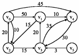

1.	Please show the shortest paths from V4 to other nodes in the following graph by Dijkstra’s Algorithm. (20pts)  (Note: Detailed steps are required; otherwise, you will get zero point.)

S	V - S	V0	V1	V2	V3	V5
V4	V0V1V2V3V5	INF	INF	INF	30
(V4V3)	INF
V3V4	V0V1V2V5	INF	50
(V4V3V1)	INF		INF
V1V3V4	V0V2V5	INF		65
(V4V3V1V2)		INF
V1V2V3V4	V0V5	85
(V4V3V1V2V0)				INF
V0V1V2V3V4	V5					INF
V0V1V2V3V4V5						
						
